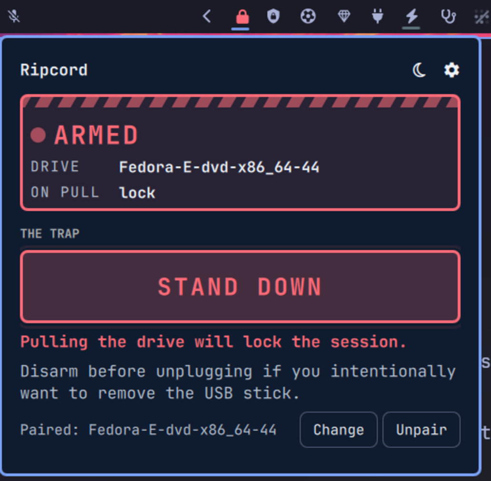

# Ripcord

<p align="center">
  
</p>

Pair a USB drive to your machine and carry it on a lanyard. If the drive is
pulled out, the session locks — and, if you ask it to, the machine goes to
sleep.

The idea is a failsafe for working in public: the drive is tethered to you, so
if the laptop is snatched the drive comes out with you and the machine is
behind a password prompt before it has left the table.

It is a deterrent against a snatch-and-run. It is not a defence against someone
who has your machine and time — see [What it cannot do](#what-it-cannot-do).

The concept is borrowed from [RipCord](https://github.com/kclose3/RipCord), a
macOS project by [KClose](https://github.com/kclose3). This is an independent
implementation for Omarchy and shares no code with it.

## How it works

**Pair a drive, arm the trap, and pull the drive to fire it.**

- **The key is the physical drive**, identified by the serial in its USB
  descriptor. Relabelling the drive does not break the pairing, and neither
  does reformatting it. A drive *named* to match yours cannot stand in for it.
  Drives that report no serial fall back to the SCSI serial, then the wwid,
  then a partition identifier — the last of which does not survive a reformat.
- **One row per drive, not per partition.** A single installer stick can carry
  three filesystems; you plug in one thing, so the list shows one thing, named
  by its volume with the hardware name and size underneath.
- **Only drives you can physically pull out are offered.** Anything reached
  over the USB bus, plus anything the kernel reports as removable. The disk
  your system runs from is never offered, so the trap cannot be set on
  something that can only be removed by accident.
- **Arming binds to the drive you armed on**, not merely to "something with the
  right serial is still attached". This matters because cheap flash drives are
  routinely shipped with duplicate or absent serials: if a second drive
  answering to the same identity were enough to satisfy the trap, pulling your
  real key would go unnoticed.
- **It watches for events, not on a timer.** The kernel tells it when the set
  of attached drives changes and it re-reads to confirm. A slow re-read runs as
  a backstop so a missed event cannot leave the trap blind.

## What it does when the drive is pulled

Whatever you have enabled, in this order:

| Response | Default | What happens |
|---|---|---|
| **Lock the session** | on | The lock screen appears; the machine stays awake |
| **Put the machine to sleep** | **off** | Power is cut to everything but memory; the lock screen is waiting when it wakes |

Sleeping is off until you turn it on. Locking your own session is
unremarkable; putting the machine to sleep is worth a deliberate decision
rather than arriving switched on.

**Rehearsal mode is on by default.** While it is on, pulling the drive sends a
notification saying what *would* have happened and does nothing else. Leave it
on until you have watched the trap fire once — nobody should have to get locked
out of their own laptop to discover whether they configured it correctly.

**After it fires, it does not re-arm on its own.** The drive has to be plugged
back in first, so unlocking after a trigger does not walk straight into the
next one.

**Arming is never remembered.** It is not written to disk and does not survive
a restart, a shell reload or a crash. Every armed session is one you asked for.

## What it tells you

**In the bar**, a padlock: closed when armed, open when not. Red when arming
would really lock the machine, amber while it is only rehearsing, and the
ordinary bar colour when the trap is off.

**In the panel**, a status block that changes colour and grows an animated
hazard bar while the trap is set, above a readout of which drive is paired,
whether it is connected, and exactly what a pull will do.

**When something is wrong, it says so rather than appearing to be on guard:**

- the drive watcher stopping while armed
- a lock that fails, or that reports success without the session actually
  locking
- two attached drives answering to the same identity — arming is refused while
  that is true, because the trap could not tell them apart
- a drive list too large to read, which means it is working from stale
  information

## Appearance

Ripcord paints its own surface rather than following the active theme: plain
dark blue, or off-white in light mode. The moon in the panel header switches
between them and the choice is remembered.

This is a deliberate break from the rest of the shell. The panel's job is to be
unmistakable at a glance, and it cannot promise that when the ground under it
changes with every theme. Every colour in both modes is at least 4.5:1 against
its own background, which is only checkable because the background is known.

## Choosing a drive

**Use a drive with nothing on it you care about.** The whole point is that it
gets yanked out without warning, and pulling a mounted filesystem mid-write can
corrupt it. A cheap empty stick costs nothing to replace and nothing to lose —
the drive is a key, not storage.

If you must use one that carries data, unmount it before arming. Ripcord
watches for the device disappearing, not for it being mounted, so an
unmounted-but-attached drive still arms and still fires when it is physically
removed.

## Requirements

Python 3, which Omarchy already has. Nothing else — the drive watching uses
kernel facilities reached through the C library, so there is no watcher package
to install.

## Install

```bash
omarchy plugin add https://github.com/weedwhitesandwine/ripcord.git --enable
```

Then add **Ripcord** to your bar from the shell's bar settings, open it, plug
your drive in, and click the drive to pair it.

## Update

```bash
omarchy plugin update io.github.weedwhitesandwine.ripcord
```

## Remove

```bash
omarchy plugin remove io.github.weedwhitesandwine.ripcord
```

Removing the plugin leaves your settings behind at
`~/.local/state/omarchy/ripcord/`. Delete that directory to clear them.

## What it writes, and when

**Files it writes**

| Path | When | What |
|---|---|---|
| `~/.local/state/omarchy/ripcord/settings.json` | When you pair, unpair, or change a setting | The paired drive's identifier and name, the lock and sleep toggles, rehearsal mode, and the light/dark choice |

That is the only file it writes. The state directory is created with
owner-only permissions, and writes go through the shell's atomic-write path.
Whether the trap is armed is deliberately *not* written anywhere.

Ripcord does not touch your Hyprland configuration, your bar layout, or any
other file belonging to you or to the shell. It offers no hotkey, so it has
nothing to add to your keybindings.

**Files it reads**

| Path | Why |
|---|---|
| `/dev/disk/by-uuid`, `/dev/disk/by-label` | Which filesystems are attached, and what they are called |
| `/sys/block/…`, and the USB device nodes above them | To identify each drive — serial, model and size — and to tell one you can unplug from one that is bolted in |
| its own `settings.json` | To restore your pairing and settings |

Its settings file is opened without following symlinks, checked to be a regular
file, and read to a fixed ceiling, so a file that has been replaced with
something else yields nothing rather than something. Measured: a 191 MB file
planted at that path is refused with the reading process peaking at 14 MB, a
FIFO is refused rather than hanging, and a symlink is refused.

**Processes it runs**

| Command | When |
|---|---|
| `python3 ripcord-watch.py` | Once, for the life of the shell — the drive watcher |
| `python3 -c …` | To read the settings file to a ceiling, at startup and whenever it changes on disk |
| `mkdir -p -m 700` | Once at startup, for the state directory |
| `omarchy-system-lock`, or `hyprlock`, or `loginctl lock-session` | When the trap fires and locking is enabled — the first of those that exists |
| `omarchy-hyprland-session-locked` | About a second after a lock, to confirm the session really locked |
| `systemctl suspend` | When the trap fires and sleeping is enabled (off by default) |
| `notify-send` | Seven situations: a rehearsal trigger; a trigger with no response enabled; a lock command that fails; a lock that reports success while the session stays unlocked; the watcher stopping while armed; a second drive claiming the paired identity while armed; and a drive list that cannot be read while armed |

Every one of these runs as you, with your own session's permissions. Nothing
here needs or requests elevation. The watcher is started with
`setpriv --pdeathsig TERM` so it cannot outlive the shell.

**Why the lock order is what it is.** On Omarchy Quattro, `loginctl
lock-session` does nothing at all *and exits 0* — so it is neither a working
lock nor a detectable failure, and a plugin trusting it would report success
while leaving the session open. `omarchy-system-lock` drives the shell's own
lock service and also locks 1Password, which is the right behaviour for the
situation this plugin exists for, so it goes first. Because a zero exit proves
nothing here, Ripcord asks the compositor a moment later whether the session
actually locked, and tells you if it did not.

**Network**

None. Ripcord opens no sockets and makes no requests.

## What it cannot do

**It runs inside the desktop shell.** If the shell stops, the watching stops
with it. The bar padlock exists so that the armed state is something you can
see rather than assume, but nothing can report a shell that is not running.

**A drive can be unplugged and plugged back in faster than any watcher can
respond.** This is a tripwire, not a lock.

**It cannot tell two drives apart if they report the same serial.** It detects
that case and refuses to arm rather than setting a trap that cannot spring, but
it cannot resolve it — unplug the other drive.

**Locking is not encryption.** Anyone who takes the machine still has your
disk. If that matters, use full-disk encryption and sleep rather than lock, so
the keys leave memory.

## Development

```bash
python3 test-classify.py     # which devices count as unpluggable
python3 test-trap-logic.py   # when the trap fires, and when it must not
```

`test-classify.py` checks the unpluggable/bolted-in decision against synthetic
device trees, including cases real hardware cannot produce on demand — a USB
SSD that does not set the removable flag, and an internal disk on a path that
merely contains the letters "usb".

`test-trap-logic.py` models the arming and triggering rules, including the case
that matters most: with a second drive attached reporting the same identity as
your key, pulling the real one still fires. It models the logic rather than
executing the QML, so the two are kept in step by hand.

## Licence

MIT. See [LICENSE](LICENSE).

Built with [Claude Code](https://claude.com/claude-code).
